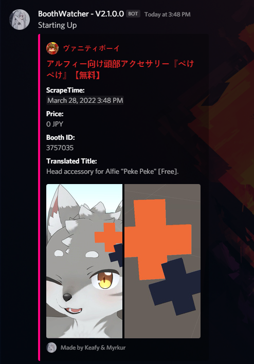
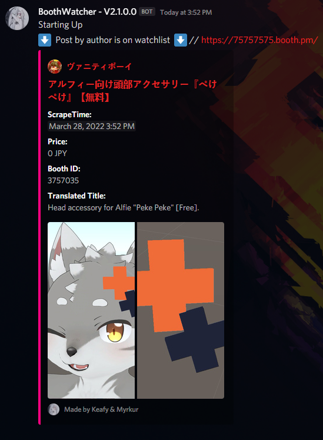

# BoothWatcher #
Get notified of new booth models using discord webhooks in c#

## Features ##
* Built with .net 6 for multi platform support.
* Support for multiple webhooks.
* Author post notification.
* Author Blacklist.

## How to use ###
> Initial setup: Download from releases or build your own, paste in your webhook into console and auto posting will begin. 

> Author Post Notification: get notified of new posts by chosen author, requires you to format in Json.

> BlackList: blacklist any author you don't want to be notified of, requires you to format in Json.


## Requirements ##
* no requirements needed to run.
* .net 6 required to compile.


## Auto Download ##
> for auto downloading of free files to function you must have BoothDownloader placed in the same folder as BoothWatcher, follow instructions there for setup.
> if you don't have it you can download it from [here](https://github.com/Myrkie/BoothDownloader)
> it will NOT function if setup improperly.

# example config #
```json
{
  "Embed FooterText": "Made by Keafy & Myrkur",
  "Startup Message": "Starting Up",
  "WebHook Override name": "BoothWatcher - V2.0.0.0",
  "Avatar Icon": "https://i.imgur.com/gEJk8uX.jpg",
  "Embed Footer Icon": "https://i.imgur.com/gEJk8uX.jpg",
  "Webhooks": [
    "https://discord.com/api/webhooks/958089154175053884/KZh0vLk4UurhxNwH5x4aLV8Ob5s8_uC7jFoFa852SO2a_p2DRJFrOTyCs7-OLjWm001I",
    "https://discord.com/api/webhooks/958089154175053884/KZh0vLk4UurhxNwH5x4aLV8Ob5s8_uC7jFoFa852SO2a_p2DRJFrOTyCs7-OLjWm001I"
  ],
  "Watchlist": [
    "https://ponderogen.booth.pm/",
    "https://keiichiisozaki.booth.pm/"
  ],
  "Blacklist": [
    "https://aemeth.booth.pm/",
    "https://akanienne.booth.pm/",
    "https://aleasevr.booth.pm/",
    "https://apyr.booth.pm/",
    "https://aqtie.booth.pm/"
  ],
  "KeywordBlacklist": [
    "eye",
    "vroid"
  ],
  "Already Posted list": "AlreadyAddedId.txt",
  "Proxy Username": "proxy-username",
  "Proxy Password": "proxy-password",
  "Proxy Host": "proxy-host",

  "_tts": false
}
```

# example of operation #




# example author post notification #


External Libraries used:
- [DeepL-API](https://github.com/Myrkie/Deepl) - Simple DeepL
